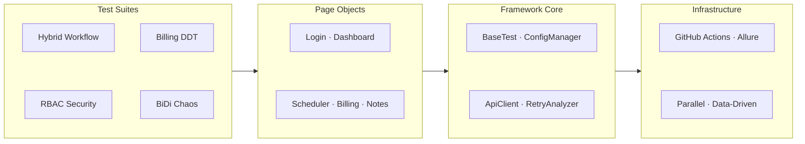

# 🛡️ GuardianEHR — Healthcare Automation Framework

> **Selenium 4 BiDi · RestAssured · TestNG · Allure · Java 21**
>
> A production-grade test automation framework built for behavioral health EHR systems,
> demonstrating Shift-Left quality engineering, HIPAA-aligned RBAC testing,
> and Selenium 4 BiDi chaos engineering.

---

## 📐 Architecture



---

## 🎯 Design Philosophy

### 1. Shift-Left Testing
Instead of creating test data exclusively through the UI, the framework uses **RestAssured API calls** to seed patient records and appointments, then validates them in the Selenium UI layer. This dramatically reduces test execution time and eliminates UI-based data setup fragility.

### 2. BiDi Network Interception (Selenium 4)
The framework leverages the **Selenium 4 Bidirectional Protocol** to intercept and monitor all network requests during test execution. This catches **silent API failures** — situations where the UI appears to work but the underlying API call failed. This is critical in healthcare where unlogged data loss could violate HIPAA.

### 3. RBAC Security as a First-Class Concern
Role-Based Access Control is tested systematically using **data-driven parameterization** across all defined roles (Admin, Doctor, Billing Clerk, Intern, Front Desk). Each role is validated against a permission matrix loaded from `roles.json`, ensuring PHI access controls are enforced correctly.

### 4. Chaos Engineering
The `BiDiChaosTest` suite injects **network failures** during active sessions to verify:
- Graceful error messages appear in the UI
- No silent data loss occurs
- JavaScript console remains free of unhandled exceptions

---

## 🧪 Test Suites

| Suite | Strategy | What It Proves |
|-------|----------|---------------|
| **HybridWorkflowTest** | API seed → UI verify | Shift-Left efficiency; API/UI integration integrity |
| **RBACSecurityTest** | Data-driven role matrix | HIPAA access control enforcement across all roles |
| **BillingDataDrivenTest** | JSON parameter injection | Financial calculation accuracy (12 insurance scenarios) |
| **BiDiChaosTest** | Network fault injection | Application resiliency under adverse conditions |

---

## 🏗️ Project Structure

```
GuardianEHR/
├── pom.xml                          # Maven config (Java 21)
├── src/
│   ├── main/java/com/guardian/
│   │   ├── api/
│   │   │   └── ApiClient.java       # RestAssured + auth caching
│   │   ├── base/
│   │   │   └── BaseTest.java        # ThreadLocal + BiDi interceptor
│   │   ├── config/
│   │   │   └── ConfigManager.java   # CI/CD-overridable config
│   │   ├── pages/
│   │   │   ├── LoginPage.java       # Fluent POM
│   │   │   ├── DashboardPage.java   # RBAC visibility checks
│   │   │   ├── SchedulerPage.java   # Patient search
│   │   │   ├── BillingPage.java     # Calculator verification
│   │   │   └── PatientNotesPage.java# PHI access control
│   │   └── utils/
│   │       └── RetryAnalyzer.java   # Flaky test management
│   └── test/
│       ├── java/com/guardian/tests/
│       │   ├── HybridWorkflowTest.java
│       │   ├── RBACSecurityTest.java
│       │   ├── BillingDataDrivenTest.java
│       │   └── BiDiChaosTest.java
│       └── resources/
│           ├── config.properties
│           ├── testng.xml           # Parallel suite config
│           ├── roles.json           # RBAC permission matrix
│           ├── billing_data.json    # Insurance test scenarios
│           └── webapp/              # Mock EHR application
│               └── index.html
├── .github/
│   └── workflows/
│       └── automation.yml           # CI/CD pipeline
└── README.md
```

---

## 🚀 Getting Started

### Prerequisites
- **Java 21** (Eclipse Temurin recommended)
- **Maven 3.9+**
- **Chrome** (latest stable)

### Run Tests Locally
```bash
# Full suite (visible browser)
mvn clean test

# CI mode (headless)
mvn clean test -Dheadless=true

# Specific suite only
mvn clean test -Dtest=RBACSecurityTest

# Override browser
mvn clean test -Dbrowser=firefox
```

### Generate Allure Report
```bash
mvn allure:serve     # Opens report in browser
mvn allure:report    # Generates to target/site/
```

---

## 📊 Reporting

The framework generates **Allure Reports** with:
- ✅ Test case pass/fail status with execution timelines
- 📸 Automatic screenshots on failure
- 🔗 Step-by-step traceability
- 🌐 Network interceptor logs
- 📈 Historical trend tracking (via GitHub Pages deployment)

---

## 🔄 CI/CD

The GitHub Actions pipeline (`.github/workflows/automation.yml`) runs on every push to `main`/`develop`:

1. **Provision** — JDK 21 + Chrome
2. **Execute** — Full test suite in headless Chrome
3. **Report** — Allure report generated and uploaded as artifact
4. **Deploy** — Report published to GitHub Pages (main branch only)

---

## 🧠 Key Engineering Decisions

| Decision | Rationale |
|----------|-----------|
| **ThreadLocal&lt;WebDriver&gt;** | Thread-safe parallel execution without test interference |
| **BiDi over CDP** | Future-proof W3C standard vs. deprecated Chrome DevTools Protocol |
| **RestAssured for test data** | 10-100x faster than UI-based setup; decouples data seeding from UI state |
| **JSON data files** | Readable by QA, editable without code changes, version-controlled |
| **SoftAssert in RBAC** | Captures ALL permission violations per role vs. failing on first |
| **RetryAnalyzer** | Reduces pipeline noise from intermittent failures; surfaces true flaky tests |
| **Mock webapp included** | Framework is fully self-contained; no external dependencies needed |

---

## 📋 TherapyNotes Alignment

This framework directly addresses the core requirements of the Senior QA Engineer role:

| Requirement | Implementation |
|-------------|---------------|
| "Selenium automation" | Full Page Object Model with fluent interfaces |
| "API testing" | RestAssured client with auth caching and CRUD operations |
| "Java + OOP" | Clean object-oriented design with inheritance, encapsulation |
| "CI/CD integration" | GitHub Actions pipeline with parallel execution |
| "Test framework design" | TestNG with data providers, retry logic, soft assertions |
| "Healthcare domain" | HIPAA-aligned RBAC testing, PHI access validation |
| "Quality mindset" | BiDi chaos testing, billing accuracy, network failure detection |

---

## License

This project is a portfolio demonstration piece.
